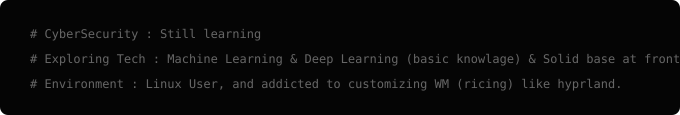

<div align="center">
  
</div>

# $ Expertise

<p align="center">
  
</p>

# $ Tech Stack

<p align="center">
  
</p>

* **Tools & Environments :** ```
  `NixOS` • `Linux` • `GitHub` • `Git`• `Figma` • `Gimp` • `Hyprland` • `Vim` • `Fish` • `Alacritty` ```

* **Languages & libraries :** ```
  `Nix` • `JavaScript` • `CSS3` • `HTML5` • `TensorFlow` • `Python` • `NumPy` • `C++` • `Testing-Library` ```
